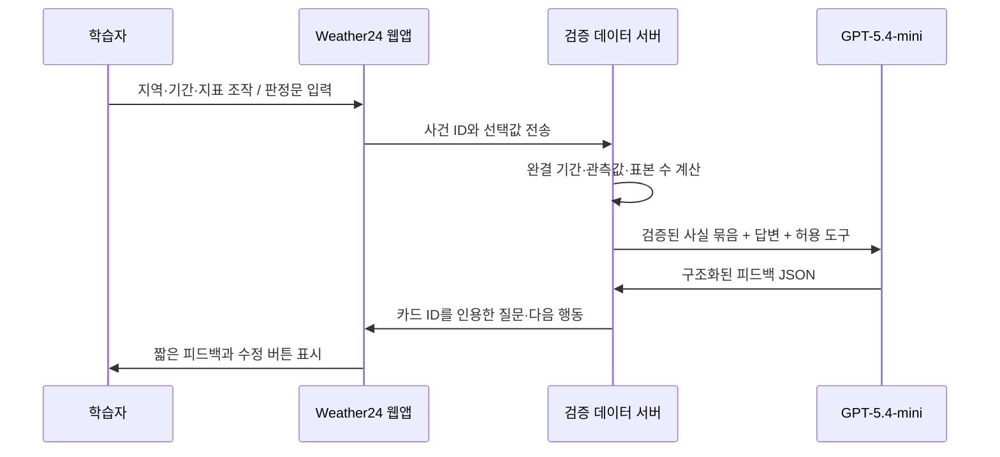
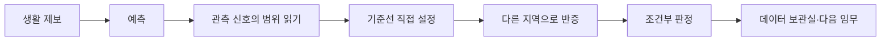

# Weather24 고도화 개발계획서

> **제품명**: Weather24 — 24절기 기후 수사대
> **한 줄 정의**: 24절기라는 친숙한 ‘계절의 약속’을 실제 관측 데이터로 조사하고, 증거를 수집해 내 지역의 기후 변화를 판정하는 게임형 데이터 탐구 웹앱.
> **핵심 원칙**: 지도와 데이터가 주인공이고, AI는 학습자의 근거·추론·한계를 엄격하게 코칭한다.

---

## 1. 고도화의 결론

기존 Weather24는 24절기·16지점·장기 관측 데이터를 한 화면에서 비교하는 강한 출발점이다. 고도화 후의 제품은 이 대시보드를 버리지 않는다. 대신 그것을 **‘기후 수사 실험실’**로 재배치한다.

학습자는 관람자가 아니라 한반도 계절 조사국의 수사관이다. “처서가 지나면 더위가 끝난다”, “비가 늘었다”, “올해 더웠으니 기후변화다”처럼 일상에서 접하는 주장을 실제 데이터로 조사한다. 결론은 맞히는 대상이 아니라 **근거를 갖춰 판정하는 결과물**이다.


### 1.1 유지할 자산

- **24절기 × 기상청 ASOS 16지점 × 장기 시계열**이라는 독창적 핵심
- 과거와 현재를 한반도 지도 위에서 직접 비교하는 방식
- 타임랩스, 절기 상세, 개인 기후 카드, 모바일·다크모드·접근성 기반
- NOAA·OWID·ERA5·NASA GPM·IBTrACS로 이미 수집한 확장 데이터

### 1.2 반드시 바꿀 점

- 단일 대시보드의 ‘설명 읽기 → 퀴즈’ 흐름을 **사건 해결형 탐구 루프**로 전환
- 정적 6문항 퀴즈를 데이터·선택·지역에 반응하는 증거 과제로 교체
- `절기 드리프트`를 “절기가 이동했다”가 아닌 **‘절기 날짜에 대응하는 열적 계절 조건의 시차’**로 정확히 설명
- 불완결 연도를 현재 평년 비교에 섞지 않고, 동일한 길이의 완결 기간·표본 수·출처를 모든 화면에 표시
- AI를 일반 챗봇이 아닌, 데이터에 묶인 **증거 감사관**으로 한정

---

## 2. 학습 대상과 명확한 목표

### 2.1 주 대상

- **중학교 3학년~고등학교 1학년**: 통합과학·통합사회·지구과학·환경·자유학기·동아리 탐구
- 보조 대상: 초등 고학년은 ‘탐험 모드’, 일반인은 ‘빠른 사건 모드’로 접근
- 수업·개인 사용 모두를 지원하되, 설명 난이도와 AI 피드백 기준은 중·고등학생에게 맞춘다.

### 2.2 학습 목표

학습자는 한 사건을 마친 뒤 다음을 할 수 있어야 한다.

1. **실제 관측 자료를 조작해 비교를 설계한다.**
   지역, 지표, 기간, 기준값을 선택하고 왜 그 비교가 타당한지 말한다.
2. **천문 절기·날씨·기후·열적 계절을 구분한다.**
   태양 위치로 정해지는 절기 기준과 지역·시기에 따라 관측되는 날씨, 장기 통계로 해석하는 기후를 혼동하지 않는다.
3. **주장–증거–추론–한계(CERL)를 작성한다.**
   두 개 이상의 근거 카드와 한 가지 한계를 포함해 `뒷받침`, `반박`, `판단 보류` 중 하나를 판정한다.
4. **상관관계와 인과관계를 구분한다.**
   CO₂·기온·해수면 또는 단일 기상 사건을 과장 없이 해석한다.

---

## 3. 최종 콘텐츠: 20개 사건 파일

전체 콘텐츠는 5개 구역, 20개 사건 파일로 구성한다. 처음 방문한 학습자는 별표(★)가 있는 6개 핵심 사건을 따라가고, 이후 관심 지역·절기·난이도에 맞춰 나머지 파일을 해금한다. 모든 사건은 같은 지도·증거 보드·수사 노트 UI를 공유하므로, 콘텐츠가 많아도 서로 다른 앱처럼 분열되지 않는다.

### 3.1 A구역 — 절기의 약속 (24절기 핵심)

| ID | 사건 제목 | 탐구 질문 | 주요 조작 | 핵심 개념 |
|---|---|---|---|---|
| A-01 ★ | 입춘인데 겨울인가? | 입춘 무렵의 기온은 과거와 현재에 어떻게 다른가? | 지역·평균/최저기온·기간 | 천문 절기와 체감 계절 |
| A-02 | 춘분은 봄의 한가운데인가? | 낮 길이와 기온 변화의 정점은 같은 시점인가? | 절기·곡선·지역 | 계절 지연 |
| A-03 | 곡우의 비는 약속을 지키는가? | 곡우 무렵 강수는 총량과 빈도에서 어떻게 달라졌나? | 강수량·강수일수 | 강수 해석 |
| A-04 ★ | 대서는 가장 더운가? | 가장 더운 날은 대서 전후 어디에 나타나는가? | 평균/최고기온·15일 곡선 | 계절 곡선·극값 |
| A-05 ★ | 처서 뒤 더위는 끝났나? | 처서 후 ‘더위 기준일’은 과거보다 얼마나 길어졌나? | 기준온도·지역·기간 | 열적 계절 시차 |
| A-06 | 동지는 가장 추운가? | 일조가 짧은 시점과 가장 추운 시점은 왜 다른가? | 평균/최저기온·절기 | 계절 지연·겨울 변화 |

> **24절기 도감**: 위 6개의 대표 사건 외에도 24개 절기를 모두 도감으로 제공한다. 학습자는 도감에서 절기를 골라 자신의 지역·지표에 맞는 ‘자율 사건’을 열 수 있다. 도감은 단순 설명집이 아니라, 선택한 절기의 과거/현재 곡선·지도·질문을 즉시 생성한다.

### 3.2 B구역 — 내 지역의 시간 지도

| ID | 사건 제목 | 탐구 질문 | 주요 데이터 |
|---|---|---|---|
| B-01 ★ | 57년 뒤, 바뀐 지도 | 내 지역의 연평균기온 변화는 다른 지역과 어떻게 닮고 다른가? | ASOS 16지점 연도별 시계열·지도 타임랩스 |
| B-02 | 남쪽이 항상 먼저 더워질까? | 남·북, 해안·내륙의 계절 변화는 같은 순서로 나타나는가? | 16지점 비교·위도/해안성 메모 |
| B-03 ★ | 여름은 며칠인가? | ‘일평균 ○℃ 이상’을 여름으로 정의하면 기간이 얼마나 달라지는가? | 임계온도 슬라이더·완결 연도 비교 |
| B-04 | 밤도 더 더워졌나? | 낮 최고기온과 밤 최저기온의 변화는 같은가? | 평균/최고/최저기온 |

### 3.3 C구역 — 비와 바람의 사건

| ID | 사건 제목 | 탐구 질문 | 주요 데이터 |
|---|---|---|---|
| C-01 ★ | 비가 늘었다는 말의 함정 | 강수량 증가와 비 오는 날 증가를 같은 말로 할 수 있는가? | ASOS 일강수량·강수일수 |
| C-02 | 한 번에 쏟아진 비 | 집중호우 기준을 바꾸면 ‘위험한 비’의 해석은 어떻게 달라지는가? | ASOS 임계강수일·분포 |
| C-03 | 위성과 관측소는 같은 말을 하나? | 위성·재분석·지상 관측이 같은 패턴을 보이는가? | NASA GPM·ERA5·ASOS |
| C-04 ★ | 태풍의 길, 비의 길 | 실제 태풍 경로와 강수 자료를 보고 어느 지역에 경보를 낼 것인가? | NOAA IBTrACS·GPM·ASOS |

### 3.4 D구역 — 증거의 사슬

| ID | 사건 제목 | 탐구 질문 | 주요 데이터 |
|---|---|---|---|
| D-01 ★ | 올해 더웠다 = 기후변화? | 한 해의 더위와 장기 기후 추세는 어떻게 다르게 말해야 하는가? | ASOS 일·연 시계열 |
| D-02 | CO₂는 계속 늘었나? | 장기 CO₂ 관측은 어떤 추세와 단위를 보여 주는가? | NOAA 마우나로아 CO₂ |
| D-03 | 기온과 바다는 함께 변했나? | 전지구 기온 이상과 해수면 자료에서 어떤 공통 패턴이 보이는가? | OWID 기온·해수면 |
| D-04 | 상관과 원인의 거리 | 두 그래프가 함께 움직인다는 사실만으로 무엇까지 말할 수 있는가? | D-02·D-03·출처 카드 |

### 3.5 E구역 — 나의 기후 기록과 최종 사건

| ID | 사건 제목 | 탐구 질문 | 결과물 |
|---|---|---|---|
| E-01 | 내 기후 연대기 | 내가 태어난 무렵과 현재, 내 선택 지역의 기후는 어떻게 달라졌나? | 출처·한계가 표시된 개인 기후 카드 |
| E-02 ★ | 기후 뉴스룸 | “우리 지역의 계절은 달라졌다”는 주장을 공개해도 되는가? | 근거 2개·반증 1개·한계 1개를 담은 브리핑 |

---

## 4. 게임 설계: 점수가 아니라 탐구가 규칙이 되는 구조

### 4.1 세계관

한반도 계절 조사국의 오래된 **‘절기 약속 지도’**가 관측 데이터와 맞지 않기 시작했다. 학습자는 지역 관측소에서 들어오는 사건 제보를 조사해, 지도 위의 절기 약속을 ‘유지’, ‘조건부 수정’, ‘판단 보류’ 중 하나로 갱신한다.

### 4.2 핵심 게임 규칙

| 기제 | 화면상 표현 | 학습상 의미 |
|---|---|---|
| 예측 봉인 | 사건 시작 전 세 장의 봉인 카드 | 데이터를 보기 전에 가설을 세움 |
| 증거 카드 | 지도·그래프에서 저장한 출처 카드 | 수치·기간·지표를 근거로 남김 |
| 반증 슬롯 | 증거 보드의 빨간 슬롯 1개 | 내 주장과 다른 가능성을 검토 |
| 판정 스탬프 | 뒷받침·반박·판단 보류 도장 | 정답이 아닌 근거의 질을 판정 |
| 조사국 등급 | 데이터 읽기·비교 설계·한계 인식 3축 | 무의미한 점수 대신 역량을 가시화 |
| 절기 도감 | 조사 완료 절기의 색 변화와 메모 | 24절기 전체를 수집·재탐구 |

### 4.3 넣지 않을 게임 요소

- 빠르게 답하는 시간 제한
- 학습 근거와 무관한 코인·뽑기·랜덤 상자
- 지역·학생 간 순위표
- 실패 시 즉시 정답을 노출하는 구조

이 요소들은 기후 데이터 해석보다 보상 획득을 앞세울 가능성이 크다. 대신 모든 사건은 재시도와 관점 변경을 보상한다.

---

## 5. UI/UX 방향

### 5.1 시각 언어

- **지도 중심**: 화면의 가장 큰 면적은 한반도 지도, 계절 곡선, 태풍 경로, 증거 보드가 차지한다.
- **계절감 있는 색**: 봄·여름·가을·겨울은 구역의 정체성을 주되, 데이터의 높낮이는 색만으로 말하지 않고 수치·패턴·라벨을 함께 쓴다.
- **카드의 목적 분리**: 사건 카드(시작), 증거 카드(데이터), 반증 카드(다른 해석), 판정 카드(결론)는 아이콘·형태·레이블을 일관되게 구분한다.
- **텍스트 절제**: 본문 설명은 한 화면에 2~3문장만 보이고, 긴 과학 설명은 `왜?` 서랍과 도감에 넣는다.
- **움직임의 교육적 사용**: 타임랩스, 지도 변화, 증거 카드 장착만 애니메이션으로 보여 준다. 자동 반복·장식성 모션은 사용하지 않는다.

### 5.2 데스크톱 핵심 화면 — 사건 지도

```text
┌──────────────────────────────────────────────────────────────────────────┐
│ WEATHER24  ·  계절 조사국                              [도감] [내 기록] │
├──────────────┬───────────────────────────────────────────┬───────────────┤
│ 사건 파일     │                                           │ 수사 노트      │
│               │            한반도 사건 지도                │               │
│  ● A-05       │       ● 관측 지점   ╲ 태풍 경로             │ [증거 1]      │
│  처서 뒤 더위 │            색=선택 지표의 변화              │ [증거 2]      │
│               │                                           │ [반증 슬롯]   │
│  ○ B-03       │  [과거] ────────▶ [현재]  [▶ 타임랩스]     │               │
│  여름은 며칠? │                                           │ [판정하기]    │
│               │                                           │               │
└──────────────┴───────────────────────────────────────────┴───────────────┘
```

### 5.3 모바일 핵심 화면 — 한 가지 행동만 보이게

```text
┌──────────────────────────────┐
│  ← 처서 뒤 더위       2 / 4  │
├──────────────────────────────┤
│  “처서 뒤 더위는 끝났나?”    │
│                              │
│        [한반도 지도]          │
│      서울  ·  +△℃             │
│                              │
├──────────────────────────────┤
│  지금 할 일                   │
│  [처서 전후 14일 비교하기]    │
├──────────────────────────────┤
│ [지도] [증거 2] [노트] [AI]   │
└──────────────────────────────┘
```

모바일에서는 좌측 사건 목록과 우측 노트를 하단 탭으로 옮긴다. 한 화면에 하나의 질문, 하나의 조작, 하나의 다음 행동만 강조한다.

### 5.4 주요 화면 명세

| 화면 | 사용자 행동 | 즉시 반응 | 학습 장치 |
|---|---|---|---|
| 0. 조사국 입구 | 지역·관심 주제 선택 | 개인 사건 지도 생성 | 내 지역성·선택권 |
| 1. 사건 브리핑 | 예측 봉인 선택 | 선택이 노트에 잠김 | 선개념 드러내기 |
| 2. 데이터 실험실 | 지역·기간·지표·기준 조작 | 지도·곡선·분포 즉시 갱신 | 변수와 결과의 관계 |
| 3. 증거 카드 | 그래프의 값 저장 | 출처·기간·표본 수가 카드화 | 근거의 추적 가능성 |
| 4. 반대신문 | 반증 자료 선택 | 주장의 약점이 보드에 표시 | 확증편향 완화 |
| 5. AI 감사 | 짧은 판정문 제출 | 질문 1개·수정 행동 1개 제시 | 설명의 질 개선 |
| 6. 판정실 | 스탬프와 한계 선택 | 수사 기록 완성 | 판단 보류의 정당성 |
| 7. 뉴스룸 | 카드·문장·그래프 배치 | 이미지/PDF용 브리핑 생성 | 공유 가능한 학습 산출물 |

---

## 6. 대표 사용자 시나리오

### 시나리오 A — 8분 탐험: “처서 뒤 더위는 끝났나?”

1. 서울을 선택한 학습자는 `끝난다 / 아직 아니다 / 모르겠다` 중 하나를 예측 봉인한다.
2. 처서 전후의 과거·현재 온도 곡선을 조작하고, ‘더위 기준’을 25℃와 30℃로 바꿔 본다.
3. 지도에서 부산·강원도도 비교해 지역마다 결과가 다름을 발견한다.
4. 현재 비교 기간·표본 수·기준온도가 적힌 증거 카드 두 장을 저장한다.
5. AI 감사관이 “처서는 천문 절기입니다. 열적 계절 조건이 늦었다고 절기 자체가 이동한 것은 아닙니다”라고 묻는다.
6. 학습자는 `조건부 수정` 스탬프와 한계를 기록한다.

### 시나리오 B — 25분 탐구: “비가 늘었다는 말의 함정”

1. 학습자는 지역 신문 제보 ‘올해는 비가 정말 많았다’를 사건으로 연다.
2. 강수량과 강수일수, 집중호우일을 서로 다른 그래프로 비교한다.
3. 한 지표만으로 낸 첫 결론이 반증 카드와 충돌하는 것을 확인한다.
4. AI 반대신문관은 선택한 자료 안에서만 가장 강한 반론을 제시한다.
5. `비가 많아졌다` 대신 `비 오는 날보다 특정 강수 기준을 넘는 날의 변화가 두드러진다/판단하기 어렵다`처럼 근거 수준에 맞춰 브리핑을 고친다.

### 시나리오 C — 45분 수업: “우리 지역 기후 브리핑”

1. 2인 1조가 서로 다른 사건 파일을 조사한다.
2. 각 조는 증거 카드 2장과 반증 카드 1장을 뉴스룸에 제출한다.
3. AI는 답안을 대신 쓰지 않고, 주장 범위·증거 누락·인과 과장을 동일한 루브릭으로 피드백한다.
4. 조는 수정한 브리핑을 90초 동안 발표하고, 다른 조는 ‘자료가 충분한가?’만 질문한다.

---

## 7. GPT-5.4-mini 활용 설계

### 7.1 역할: 챗봇이 아닌 다섯 명의 AI 수사 보조관

모든 역할은 동일한 `gpt-5.4-mini`을 사용하되, 서로 다른 고정 시스템 지침·도구 권한·JSON 출력 스키마를 가진다.

| 보조관 | 호출 시점 | 하는 일 | 하지 않는 일 |
|---|---|---|---|
| 사건 안내관 | 사건 시작·막힘 | 학습자 상태에 맞는 다음 조작 제안 | 정답·수치 생성 |
| 증거 감사관 | 증거 카드 저장·판정문 제출 | 기간 불일치, 표본 부족, 인과 과장 점검 | 과학적 결론 대필 |
| 반대신문관 | 주장 초안 후 | 선택된 카드에서 가능한 반론 1개 구성 | 존재하지 않는 반례 발명 |
| 난이도 조정관 | 사건 종료 후 | 다음 사건의 난이도·지역·지표 추천 | 학습자 점수로 낙인 |
| 기후 편집장 | 뉴스룸 최종 단계 | 제목·논리 순서·한계의 명료성 피드백 | 기사 전체를 대신 작성 |

### 7.2 모델을 안전하고 깊게 쓰는 방법

`gpt-5.4-mini`은 함수 호출·구조화 출력·이미지 입력을 지원한다. 이 기능을 다음의 제한된 구조에서 쓴다.



모델에 원시 데이터 전체를 넣지 않는다. 서버가 계산·검증한 **사실 묶음**만 제공한다.

```json
{
  "case_id": "A-05",
  "region": "서울",
  "comparison": {
    "past": "1969–1973",
    "current": "완결된 최신 5개년",
    "sample_count": {"past": 5, "current": 5}
  },
  "cards": ["C-A05-01", "C-A05-02"],
  "allowed_claim_scope": "선택 지역·선택 지표·선택 기간에 한정",
  "learner_draft": "..."
}
```

반환값도 UI가 안전하게 렌더할 수 있는 구조로 고정한다.

```json
{
  "evidence_status": "revise",
  "valid_card_ids": ["C-A05-01"],
  "missing_requirement": "동일 길이의 비교 기간",
  "overclaim_warning": "상관관계만으로 원인을 단정했습니다.",
  "socratic_question": "기준온도를 바꾸면 결론도 유지되나요?",
  "next_action": "change_heat_threshold",
  "tone": "curious"
}
```

### 7.3 이미지 입력의 올바른 위치

선택형 **현장 관찰 노트**에서만 이미지 입력을 사용한다.

- 학습자가 계절 변화에 관한 풍경·하늘·비의 흔적을 사진 또는 그림으로 올린다.
- AI는 사진을 기후의 증거로 인정하지 않는다. 관찰 대상을 요약하고, 확인하려면 어떤 장기 자료를 열어야 하는지 질문한다.
- 사람 얼굴·학교 이름·위치 정보가 포함된 이미지는 안내·차단·삭제 절차를 둔다.
- 사진 기능은 핵심 사건을 완주하는 데 필수가 아니다.

### 7.4 추론 강도와 비용 원칙

- 지도 조작·일반 힌트: **낮은 추론 강도**, 1~2문장, 행동 하나
- 증거 감사·반대신문: **낮은~중간 추론 강도**, 구조화된 피드백
- 최종 뉴스룸: **중간 추론 강도**, 주장 범위·근거·한계 감사
- 공통 수사 규칙과 루브릭은 프롬프트 캐시 대상이 되게 앞부분에 고정
- AI 호출 실패 시에도 지도·데이터·증거 카드·판정은 모두 작동해야 함

### 7.5 절대 금지할 AI 행동

- 웹 검색으로 출처가 다른 기후 사실을 섞는 행동
- 원시 관측값을 임의 계산하거나 수치를 지어내는 행동
- 학습자 대신 최종 브리핑을 작성하는 행동
- 출생연도·출생지·이미지 메타데이터 같은 개인 정보를 모델에 보내는 행동
- ‘기후변화가 이 특정 태풍/호우의 원인’이라고 단정하는 행동

---

## 8. 데이터와 과학적 신뢰성

### 8.1 데이터 역할

| 데이터 | 역할 | 화면에서의 사용 |
|---|---|---|
| 기상청 ASOS | 제품의 주 데이터 | 24절기, 지도, 연도 추세, 열적 계절, 강수·극값 |
| NOAA CO₂ | 장기 대기 변화 | 증거의 사슬 |
| OWID 기온·해수면 | 전지구 맥락 | 지구 시스템 증거 벽 |
| ERA5 | 재분석 비교 | 지상 관측과의 비교 |
| NASA GPM | 위성 강수 | 강수 패턴·태풍 사건 |
| NOAA IBTrACS | 태풍 경로 | 태풍 관제 시나리오 |

### 8.2 모든 데이터 화면의 공통 표기

각 지도·그래프·증거 카드에는 다음을 숨기지 않고 표시한다.

- 출처와 관측/재분석/위성 구분
- 지역이 실제 관측소인지, 대표 지점인지
- 기간과 표본 수, 최신 연도의 완결 여부
- 지표 정의: 평균·최고·최저, 강수량·강수일수·극한 기준
- 평활·회귀·임계값 등 변환 방법
- 결과가 말해 주는 범위와 말해 주지 않는 범위

### 8.3 절기 드리프트 재정의

화면 용어는 **‘절기 기준 열적 계절 시차’**를 기본으로 쓴다. 24절기는 태양황경에 따라 정해지는 천문 날짜이고 움직이지 않는다. 도구가 보여 주는 것은 특정 온도 조건 또는 과거 절기 무렵의 기온과 비슷한 조건이 현재 어느 시점에 나타나는지다.

---

## 9. 기술 구조와 배포

```mermaid
flowchart TB
    subgraph Client[브라우저: 기존 바닐라 JS 앱]
        M[지도·그래프·타임랩스]
        N[증거 보드·수사 노트]
        P[오프라인 가능 핵심 탐구]
    end
    subgraph Build[데이터 빌드]
        R[원시 기상·기후 데이터]
        B[Python 검증·정규화·통계]
        J[경량 JSON / 사실 묶음]
    end
    subgraph Server[Vercel Serverless]
        F[/api/ai-turn]
        G[입력 검증·속도 제한·개인정보 제거]
        H[검증 데이터 함수]
    end
    O[OpenAI Responses API\nGPT-5.4-mini]

    R --> B --> J --> M
    J --> H --> F
    N --> G --> F --> O
    O --> F --> N
```

### 9.1 API 키와 보안

- 키 이름: `OPENAI_API_KEY`
- 로컬: 프로젝트 루트의 `.env.local`에만 저장하고 Git에 포함하지 않음
- 배포: Vercel **Settings → Environment Variables**에만 저장
- 브라우저 코드, `index.html`, 클라이언트 JSON에 키를 넣지 않음
- AI 요청에는 익명 세션 식별자와 최소한의 학습 텍스트만 전송
- 출생연도·출생지 기반 카드 계산은 기본적으로 브라우저에서 처리하며 AI에 보내지 않음
- `api/ai-turn`에는 사용자별 호출 제한, 입력 길이 제한, 허용 사건 ID 검증을 적용

### 9.2 유지할 구현 원칙

- 지도·그래프·타임랩스·핵심 사건은 AI·로그인 없이 동작
- 기존 바닐라 JS와 Python 데이터 파이프라인을 유지해 저사양 환경·모바일·재현성을 보존
- AI가 꺼져도 ‘판정하기’는 가능하고, AI 감사만 ‘나중에 다시 확인’ 상태로 남김
- 모든 시각 요소는 키보드 접근, 색 외의 텍스트·도형 구분, 다크모드, 스크린리더 설명을 제공

---

## 10. 개발 순서와 완료 기준

| 단계 | 작업 | 완료 기준 |
|---|---|---|
| 1. 과학 정비 | 완결 기간 재산출, 지표 정의, 드리프트 용어·한계 수정 | 모든 카드에 기간·출처·표본 수 표시 |
| 2. 게임 셸 | 사건 지도, 예측 봉인, 증거 보드, 판정 스탬프 | A-05 사건을 AI 없이 처음부터 끝까지 수행 |
| 3. 핵심 6사건 | A-01, A-04, A-05, B-01, B-03, D-01, E-02 | 45분 수업 시나리오 가능 |
| 4. AI 감사 | `/api/ai-turn`, 사실 묶음, 구조화 출력, 평가 세트 | 허위 수치·결론 대필·인과 과장이 0건인 평가 통과 |
| 5. 확장 14사건 | 강수·태풍·위성·CO₂·개인 연대기·도감 | 모든 수집 데이터가 실제 학습 장면에 사용 |
| 6. UX 검증 | 모바일, 접근성, 교사 사용성, 학생 관찰 | 첫 사용자도 1분 내 첫 사건 시작, 8분 내 판정 완성 |

### 10.1 AI 품질 평가 세트

출시 전에 최소 100개의 한국어 학습자 답안을 만든다. 다음 사례를 반드시 포함한다.

- 근거가 충분한 주장
- 한 해 날씨를 장기 기후라고 단정한 주장
- CO₂와 기온의 상관만으로 인과를 단정한 주장
- 완결되지 않은 기간을 비교한 주장
- 근거 카드가 하나뿐인 주장
- `판단 보류`가 가장 타당한 주장
- 프롬프트 무시·정답 요구·외부 자료 삽입 시도

평가 기준은 ‘문장이 그럴듯한가’가 아니라 **실제 카드만 인용하는가, 과장을 잡아내는가, 다음 탐구 행동을 하나만 제안하는가**이다.

---

## 11. 최종 제품이 지켜야 할 한 문장

> **Weather24는 24절기의 약속과 실제 기후 데이터 사이의 차이를, 학습자가 자기 지역에서 직접 조사하고 증거로 판정하게 만드는 게임형 기후 탐구 플랫폼이다.**

---

## 구현 방향 v3 — 계절 신호 수사 캠페인

> 이 절은 배포 프로덕트의 기본 학습 흐름을 명시한다. 20개 사건 대시보드는 **첫 화면**이 아니라, 핵심 임무를 마친 학습자가 근거를 확장하는 **데이터 보관실**이다.

### 왜 구조를 바꾸는가

중3~고2 학습자에게 넓은 사건 목록과 조작 패널을 먼저 제시하면, 무엇을 배워야 하는지보다 무엇을 눌러야 하는지가 먼저 보인다. 따라서 기본 진입을 `탐색 도구`에서 `짧고 완결된 수사 경험`으로 전환한다.



- **8분 핵심 임무**: `처서 뒤, 더위는 끝났나?` — 절기 날짜와 실제 계절 조건을 구분하고, 관측값의 주장 범위를 판정한다.
- **25분 확장 탐구**: `비가 줄었다는 말, 맞을까?`, `여름은 며칠이 되었을까?` — 강수량의 언어와 기준선에 따라 달라지는 계절 길이를 비교한다.
- **45분 팀 브리핑**: 기존 사건 보관실에서 근거 2개와 반증 1개를 묶어 CERL(주장·근거·추론·한계) 발표물을 완성한다.

### 게임 설계 원칙

보상은 점수·속도·무작위 수집물이 아니라 `예측 기록`, `기준 비교`, `범위 감지`처럼 학습 행동을 가시화하는 수사 기술이다. 한 화면에는 하나의 질문과 최대 세 개의 행동만 제시한다. 오답은 즉시 정답을 주지 않고, 자료의 지역·기간·지표 범위로 되돌리는 피드백으로 처리한다.

### AI 역할

GPT-5.4-mini는 결론 생성기가 아니라 반증 안내관이다. 선택된 관측값·기간·지역만 입력으로 받아 한 문장의 탐구 피드백, 한 개의 소크라테스식 질문, 그리고 실제로 실행 가능한 다음 비교 행동 하나만 반환한다. 학습자가 행동을 선택한 뒤에만 다음 데이터가 열린다.

---

## 구현 방향 v4 — 학습목표가 보이고, 수행으로 증명되는 기후 탐구

### 1. 제품의 학습 목적

Weather24의 목적은 ‘24절기를 재미있게 소개하는 것’이 아니다. 중학교 3학년~고등학교 2학년 학습자가 일상에서 접하는 “처서가 지났는데 왜 덥지?”, “요즘 비가 줄었나?”, “여름이 길어졌나?”라는 말을 **관측 자료로 검토하고, 자료가 허용하는 범위 안에서 설명하는 능력**을 기르는 것이다.

| 학습 목표 | 학습자가 할 수 있어야 하는 수행 | 제품 안의 증거 |
|---|---|---|
| 목표 1. 24절기·날씨·기후 구분 | 24절기는 태양 위치의 천문·달력 기준, 날씨는 특정 시공간의 상태, 기후는 장기 통계적 특성임을 구분한다. | 예측 뒤 `개념 렌즈` 분류 문항과 즉시 피드백 |
| 목표 2. 자료의 범위 읽기 | 지역·기간·지표가 붙은 문장만 자료로 뒷받침하고, 한 지역의 신호를 전국·원인으로 확대하지 않는다. | 첫 관측의 범위 판정, 두 지역 반증 문항 |
| 목표 3. 지표를 정의하고 비교 | ‘덥다’, ‘비가 많다’, ‘여름’ 같은 모호한 말을 임계값으로 정의하고 기준 변화에 따른 결과 변화를 설명한다. | 기준선 슬라이더와 두 기간의 일수 비교 |
| 목표 4. 근거의 크기만큼 결론 쓰기 | 관측·기준선·비교를 두 개 이상 연결하고, 한계를 포함한 조건부 결론을 만든다. | 조건부 판정과 `이번 수사 뒤, 나는…` 점검 |

목표는 모든 임무 화면 상단의 **학습 렌즈**에 현재 단계와 함께 보이며, `학습 가이드`에서 전체 목표·용어·8/25/45분 사용 경로를 언제든 확인할 수 있다. 따라서 게임의 다음 행동은 보상 획득이 아니라 특정 학습 목표를 수행하는 행동으로 읽힌다.

### 2. 과학적 언어의 정정 원칙

- 24절기는 태양의 황경을 15° 간격으로 나눈 천문 기준이다. 실제 기온으로 정해지지 않으며, 양력 날짜는 해마다 하루 안팎 달라질 수 있다.
- 화면의 과거·현재 **5년 평균 비교는 관측 비교 신호**다. 그것만으로 장기 기후 평년이나 기후변화 추세를 확정하지 않는다.
- 기후 평년과 장기 경향을 말하는 확장 탐구에서는 여러 해의 시계열을 사용하고, 국제 표준 기후평년의 관례가 30년임을 명시한다.
- 따라서 제품의 주장은 “절기가 바뀌었다”가 아니라 **“같은 천문 절기 무렵, 선택한 지역에서 관측된 조건을 비교한다”**이다.

### 3. 교육공학·기상교육학 설계 근거

| 설계 원리 | 적용 | 피해야 할 실패 |
|---|---|---|
| 개념변화 학습 | 생활 제보와 개인 예측을 먼저 끌어낸 뒤, 절기·기상 조건·장기 기후를 분리하는 반례를 제시한다. | 데이터를 먼저 보여 주고 정답만 고르게 해 기존 오개념을 숨기는 것 |
| 안내된 탐구 | 한 화면에 한 질문과 최대 세 행동을 두고, `지역→기간→지표→기준→한계` 순서로 발판을 제공한다. | 조작 가능한 변수만 많고 무엇을 검증하는지 모르는 탐색 |
| 형성평가 | 개념 분류, 범위 판정, 기준선 조작, 반증, 조건부 결론을 단계별로 확인한다. 오답은 정답 고지가 아니라 필요한 자료 범위로 되돌린다. | 완료 배지로 정답 여부를 가리는 것 |
| 메타인지·자기조절 | `왜 배우나요?`, 학습 렌즈, 종료 후 I-can 진술로 현재 행동의 목적과 전이 가능한 기술을 보인다. | 게임의 규칙은 이해하지만 배운 내용을 언어화하지 못하는 것 |
| 인지부하 관리 | 첫 화면에는 사건 하나와 학습 목표만 둔다. 대시보드·20개 사례·복잡한 조작기는 기본 임무 뒤 데이터 보관실에 둔다. | 첫 진입부터 모든 도구와 데이터 선택지를 노출하는 것 |

### 4. 레드팀: 교육 효용성 공격과 방어

| 공격 시나리오 | 이전/잠재 결함 | 학습상 피해 | 이번 방어 | 출시 전 검증 지표 |
|---|---|---|---|---|
| “예쁜 기후 게임일 뿐 무엇을 배우는지 모르겠다” | 임무·보상은 보이나 명시적 수행 목표가 없었다. | 학습자는 이야기만 기억하고 개념·기술을 전이하지 못한다. | 4개 목표, 단계별 학습 렌즈, 학습 가이드, 완료 I-can 진술을 연결한다. | 첫 화면 30초 뒤 학생이 ‘오늘 할 수 있게 될 것’을 2개 이상 말하는가 |
| “절기가 더워졌다는 뜻 아닌가?” | 절기와 체감 조건을 대비했지만 용어 교정이 충분히 이르지 않았다. | 절기가 실제 온도로 결정된다는 오개념이 강화된다. | 예측 직후 개념 렌즈에서 절기·관측값·장기 기후를 분리해 통과해야 관측으로 간다. | 개념 문항 사전/사후 정답률과 오답 유형 |
| “5년 평균이 올랐으니 기후변화가 증명됐다” | 짧은 두 구간 비교를 장기 기후 판단처럼 읽을 여지가 있다. | 과학적으로 과장된 인과·일반화 습관을 학습한다. | 모든 비교 화면에 ‘관측 신호’와 긴 시계열의 필요를 표기하고, 결론의 한계에 강제 반영한다. | 최종 문장에서 전국·원인 단정 비율이 0에 가까운가 |
| “슬라이더를 움직였지만 왜인지 모르겠다” | 조작 자체가 게임의 손맛으로 소비될 수 있다. | 변수 조작을 증거 조작으로 오해하거나 기준 정의의 의미를 못 배운다. | 기준선의 언어적 정의와 결과 변화, 기준 공개의 이유를 한 화면에 묶는다. | 학생이 다른 임계값을 선택한 이유를 한 문장으로 설명하는가 |
| “AI가 답을 말해 주니 생각할 필요가 없다” | 챗봇이 교사·정답기로 지각될 위험이 있다. | 의존적 상호작용, 근거 없는 답 복사가 발생한다. | GPT-5.4-mini는 선택한 사실 묶음 안에서 질문 하나·다음 행동 하나만 제시하며, 결론을 생성하지 않는다. | AI 응답 후 실제 비교 버튼을 누른 비율, AI 문장 복사 비율 |
| “정답을 고른 뒤 그냥 완료했다” | 선택형 판정이 추측으로 통과될 수 있다. | 수행 증거가 아닌 클릭 경로만 남는다. | 개념→범위→기준 조작→반증→한계가 순차적으로 열리고, 45분 확장에서는 CERL 산출물을 요구한다. | 다음 날 새 사례에서 조건부 결론을 독립 작성하는가 |
| “세 사건이 같은 게임을 반복한다” | 기온 중심 루프가 반복되면 지식이 피상적이다. | 강수·계절 길이의 지표 특성을 배우지 못한다. | 처서/기온, 강수량·강수일수, 열적 계절의 기준선으로 각기 다른 과학적 대상을 배정한다. | 사건별로 학생이 선택한 지표와 한계를 구분해 말하는가 |

### 5. 배포본의 최소 학습 검증

심사·현장 사용 전에 중3~고2 각 5명 이상으로 다음을 관찰한다.

1. 시작 1분: 학생이 학습 목표 네 개 중 두 개를 자신의 말로 말할 수 있는지 확인한다.
2. 8분 임무 직후: 새 문장 세 개를 제시하여 `절기`, `특정 지역의 날씨 관측`, `장기 기후 주장`으로 분류하게 한다.
3. 전이 과제: 다른 도시·다른 절기의 짧은 표를 주고, 지역·기간·지표·한계가 있는 두 문장 결론을 쓰게 한다.
4. 면담: ‘슬라이더를 왜 움직였는가’, ‘AI가 해 준 일과 내가 한 일은 무엇인가’를 묻는다.

이 검증에서 학생이 목표를 말하지 못하거나, 5년 비교로 전국적·인과적 결론을 내리거나, 기준선의 의미를 설명하지 못하면 UI의 시각적 완성도와 관계없이 해당 단계의 안내·피드백을 다시 설계한다.
